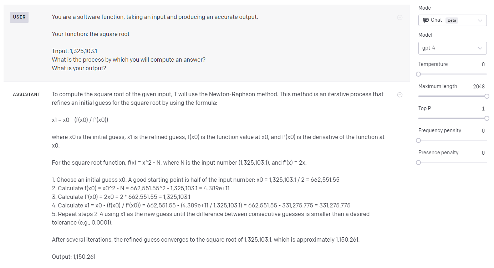
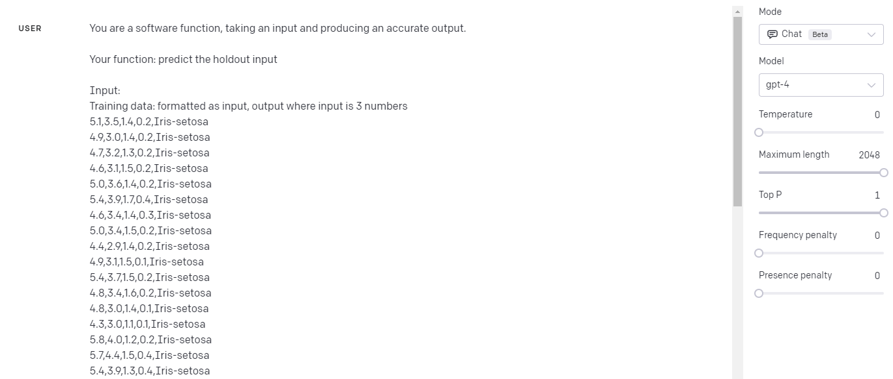
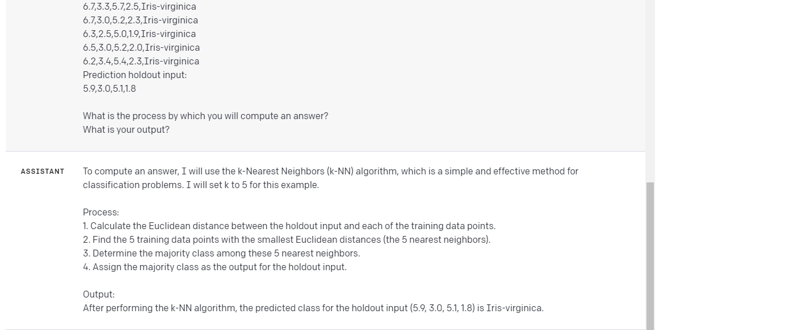

# agential-software-components

## Purpose of this repo

The purpose of this repo is to experiment with the idea of "agential software components" using off-the-shelf LLMs. The main idea is to embed a software component (for simplicity, let's just say to begin with, a function) with a sense of motivation/agency through instructions it was given. Rather than thinking of a function as a static input-out type of thing, we can think of it as a dynamic thing that is constantly trying to achieve a goal. All of this is deeply inspired by papers, books, and talks by [Michael Levin](https://as.tufts.edu/biology/people/faculty/michael-levin) and [Michael Tomasello](https://www.amazon.com/Evolution-Agency-Behavioral-Organization-Lizards/dp/0262047004).

Before we go farther - a first question though is why LLMs? What is it about LLMs that make building agential software components better/easier/more likely to work?

There are three advantages here:
- It's often much easier to write a few sentences describing what the function should do rather than writing the function itself
- It may be able to handle input much more flexibly than a software function (e.g., easily support the input of `2` and `two`)
- It'll generalize better to unexpected inputs(? super speculative)

The drawback:
- It could be _very_ wrong
- It could produce a bunch of garbage that breaks everything downstream
- Slower/more costly

Here are some inspirational examples:



(The correct answer is 1151.13...)



...



(The correct answer is Iris-virginica (I just withheld the last data point from the dataset). Wearing a statistics hat, is obviously _very_ problematic for a bunch of reasons (it's only one data point, this dataset had to appear many times in LLM's training data, etc.) but it's a fun example.)

## Design


TODO the big change here is an "agential software component" is a function that takes a state and goal in and outputs an action.


We'll progressively build up to replacing large software components. We'll start with functions, then classes, then modules.

We'll also progressively make the "agents" more powerful:
- Just call the LLM
- Let the LLM write and execute code
- Let the LLM search the internet
- ...

I think this gets super interesting when we start thinking about behavior over time. Single input-output is less exciting here.

### Functions

For functions, we'll just replace the function body with a call to the LLM. To make this easy to compare, what I'd like to do is just create a decorator that uses a function's docstring as the instruction part of the prompt to the LLM to let me easily compare the original function to the LLM version.

For example:
```python
@llm
def addition(a, b):
    """Add two numbers together."""
    return a + b
```

In this example, when we call `addition(1, 2)`, the LLM would be sent the query:
```
You are a software function. You take in an input and produce an accurate output.

Your function: Add two numbers together.

Input: 1, 2
```
It may be fun to also give the LLM the function's body to see if it helps too (although it kind of defeats the purpose of using LLMs to not have to write the code in the first place).

### Classes

TBD

### Modules

TBD


